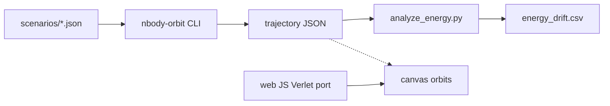

# nbody-orbit

**High-performance N-body gravity lab** — C++17 core, Python energy analysis, HTML/JS canvas visualization.

[](https://github.com/SK090347/nbody-orbit/actions/workflows/ci.yml)
[](LICENSE)
[](LICENSE-APACHE)

> Built by [Sumit Kumar Ta](https://github.com/SK090347) — portfolio project showcasing **numerics**, **systems C++**, and **interactive visualization**.

Dual-licensed **MIT OR Apache-2.0**. See [LICENSE](LICENSE), [LICENSE-APACHE](LICENSE-APACHE), and [NOTICE](NOTICE).

---

## Mathematics / Formulation

Newtonian pairwise gravity (Plummer softening $\varepsilon^2$):

$$
\mathbf{a}_i = -G \sum_{j \neq i} m_j \frac{\mathbf{r}_i - \mathbf{r}_j}{\bigl(|\mathbf{r}_i - \mathbf{r}_j|^2 + \varepsilon^2\bigr)^{3/2}}
$$

Equivalent force form without softening: $\mathbf{F}_{ij} = G\, m_i m_j\, \hat{\mathbf{r}}_{ij} / r_{ij}^2$. Softening keeps close encounters finite without changing far-field $1/r^2$ behavior.

### Integrator — velocity Verlet

$$
\begin{aligned}
\mathbf{x} &\leftarrow \mathbf{x} + \mathbf{v}\,\Delta t + \tfrac12\mathbf{a}\,\Delta t^2 \\
\mathbf{a}' &\leftarrow \mathrm{accel}(\mathbf{x}) \\
\mathbf{v} &\leftarrow \mathbf{v} + \tfrac12(\mathbf{a}+\mathbf{a}')\,\Delta t
\end{aligned}
$$

Second-order **symplectic** leapfrog: long-term energy oscillates with bounded error instead of secular drift (fixed $\Delta t$, Hamiltonian flow).

### Conserved / diagnosed quantities

$$
E = \sum_i \tfrac12 m_i \|\mathbf{v}_i\|^2 - \sum_{i<j} \frac{G m_i m_j}{\sqrt{r_{ij}^2+\varepsilon^2}}
$$

HUD and Python analysis track relative drift $|\Delta E / E_0|$.

### Complexity

| Stage | Cost | Notes |
|-------|------|-------|
| Direct force | $O(n^2)$ | Exact pairwise; CLI default |
| Barnes–Hut (documented) | $O(n\log n)$ | Octree multipole; upgrade path |
| Verlet step | $O(n^2)$ forces + $O(n)$ update | Per timestep |

**Why this formula?** Classical gravity + symplectic integration is the cleanest numerics demo that still forces you to reason about conservation, softening, and asymptotic force cost.

Deeper notes: [docs/MATH.md](docs/MATH.md).

---

## Why this exists

Classical N-body gravity is the simplest physics that still demands careful **numerical methods**:

- Naive pairwise forces are **$O(n^2)$** — fine for labs, a baseline for tree codes.
- Time integration must respect **symplecticity** so orbits don’t spiral from fake dissipation.
- Diagnostics (energy drift) separate “looks pretty” demos from trustworthy simulation.

`nbody-orbit` ships a small but complete stack: integrate → export JSON → analyze → visualize.

---

## Architecture

```
nbody-orbit/
├── cpp/                 # C++17 Verlet + O(n²) forces + JSON I/O
│   ├── include/         # body, force, integrator, json_io
│   └── src/             # CLI: nbody-orbit
├── scenarios/           # figure8.json, solar_lite.json
├── python/              # energy drift CSV + pytest
├── web/                 # canvas viz + JS port of the integrator
├── data/                # generated trajectories / CSV
├── docs/                # MATH.md
└── .github/workflows/   # CI: build, run sim, pytest
```



---

## Quick start

### Build & run (C++)

```bash
git clone https://github.com/SK090347/nbody-orbit.git
cd nbody-orbit
make -j
make run          # default figure-8 → data/trajectory.json
make demo         # figure-8 + solar_lite
```

CLI flags:

```text
./nbody-orbit --scenario scenarios/figure8.json --out data/out.json \
  --steps 20000 --dt 0.001 --frame-every 20
```

### Python analysis

```bash
python3 -m pip install -r python/requirements.txt
python3 python/analyze_energy.py data/trajectory.json -o data/energy_drift.csv
python3 -m pytest -q python/tests
```

### Browser visualization

Serve the `web/` folder (ES modules need HTTP, not `file://`):

```bash
python3 -m http.server 8080 --directory web
# open http://localhost:8080
```

Live demos: figure-8, binary+planet, Sun–Earth–Jupiter. HUD shows $t$, $E$, and $|\Delta E/E_0|$.

---

## Tests

| Check | What it proves |
|-------|----------------|
| `test_energy_relative_drift_small` | Figure-8 relative energy drift $\lt 10^{-3}$ over thousands of steps |
| `test_frame_count_matches_energy` | JSON schema / frame ↔ energy alignment |
| `test_soft_potential_finite_at_zero` | Softening remains finite at $r=0$ |

CI builds the binary with `g++ -std=c++17`, runs a short scenario, then pytest.

---

## Recruiter skills map

| Skill | Where it shows up |
|-------|-------------------|
| **Numerical methods** | Symplectic Verlet, softening, energy diagnostics |
| **Systems / C++17** | Zero-dependency CLI, header/src split, Makefile, JSON writer |
| **Performance awareness** | Explicit $O(n^2)$ baseline + Barnes–Hut upgrade notes |
| **Python tooling** | Trajectory analysis, CSV export, pytest gating |
| **Front-end viz** | Canvas trails, glow, live JS port of the same physics |
| **Engineering hygiene** | Dual license, CI, scenarios-as-data, math-documented README |

---

## Topics

`n-body` · `physics` · `cpp` · `python` · `javascript` · `simulation` · `portfolio`

## Author

**Sumit Kumar Ta** ([SK090347](https://github.com/SK090347))
